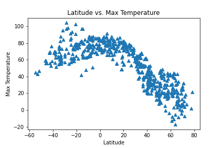

# api_challenge

A challenging challenge that took me long enough to complete.  I am very excited about having

learned this skill because it is directly applicable to some of the work I will be doing at my 

job!

**WeatherPy**

With this challenge I created a random list of cities and their latitude and longitudes.  With

this list of cities and the API key for Open Weathermap I was able to gather a host of weather 

measurements, save that data to a csv and then interpret the data.  All plots have been saved

in the pics folder.  The Lat v Max Temperature plot below is my favorite because it clearly 

shows the impact of the tilt of the earth's axis on the observed maximum temperature from the 

southern hemisphere to the northern hemisphere.

**VacationPy**

Now with all of the weather data we can try and plan our next vacation once this never ending

lockdown is lifted and Covid hopefully goes the way of the dodo.  Living in Colorado means

that we see enough of the mountains and we want to escape the snow and dry weather for a little

bit.  Take me someplace mild- between 70 and 80 degrees fahrenheit, with no clouds and little

wind!  Within the dataset of 600 locations only 12 of them had a place of "lodging" within 

5000 meters.  Who knows whether or not they are any good, ratings were not a part of the search

paramters and will be when I come back to address my unresolved items listed below.  Until then

I will be dreaming of the 12 locations highlighted below!

Unresolved items- 

1)  I was able to execute the WeatherPy script, save the csv and then create the

plots.  For some reason when I accidently went back and executed the code again it ran and then 

gave me an output saying the city was both present and not present.  Not sure why...

2) On the VacationPy there is one row that has a null hotel value that will not be deleted.  The 

original code had a removal for nulls and then I tried adding an "inplace = True" qualifier in 

and that deleted the entire df.

Given how late this homework is I am submitting knowing that the code is not perfect.